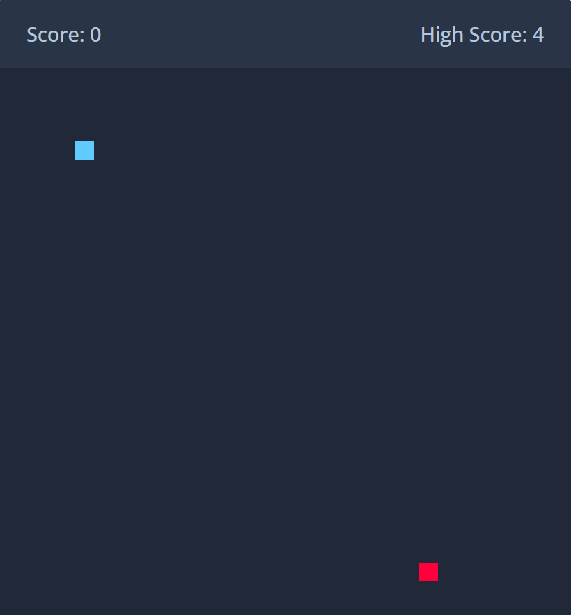

# Snake-Game-Project# Snake-Game-Project

A simple browser-based Snake game built with HTML, CSS, and JavaScript.

## Screenshot

> Replace the above image path with your actual screenshot file once ready.

## How to Run

1. Open `index.html` in a web browser.
2. Use the arrow keys or on-screen controls to move the snake.
3. Eat the food to grow longer and increase your score.

## Features

- Keyboard and touch controls
- Score tracking
- High score saved in local storage
- Game over detection on wall collision and self-collision
